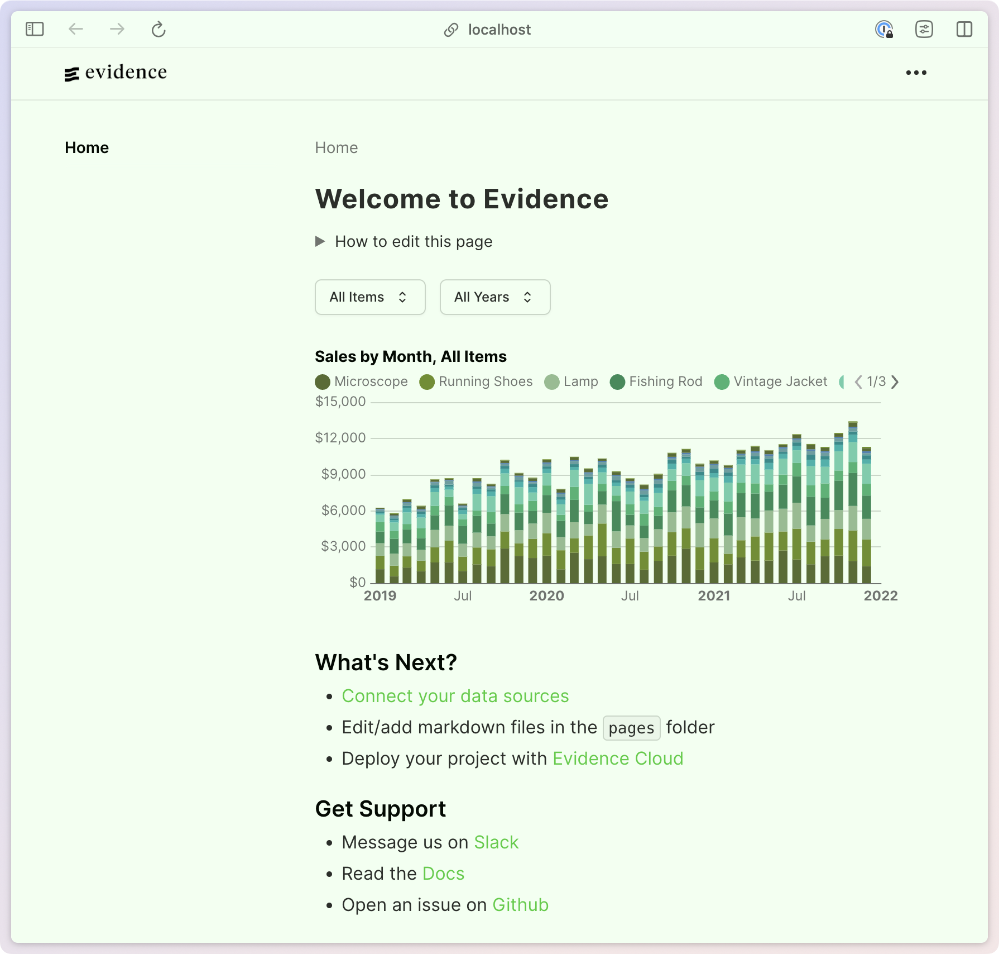

# Evidence Sample Themes

This repository contains a collection of pre-made themes for Evidence. To use a theme:

1. Choose a theme from the options below
2. Copy the `theme:` section from that theme's `evidence.config.yaml` file
3. Paste it into your project's `evidence.config.yaml` to override the default theme

Each theme includes both light and dark mode variants.

## Default

[Default Config](default/evidence.config.yaml)

| Light | Dark |
| :---: | :---: |
|  |  |

## Desert

[Desert Config](desert/evidence.config.yaml)

| Light | Dark |
| :---: | :---: |
|  |  |

## Forest

[Forest Config](forest/evidence.config.yaml)

| Light | Dark |
| :---: | :---: |
|  |  |
