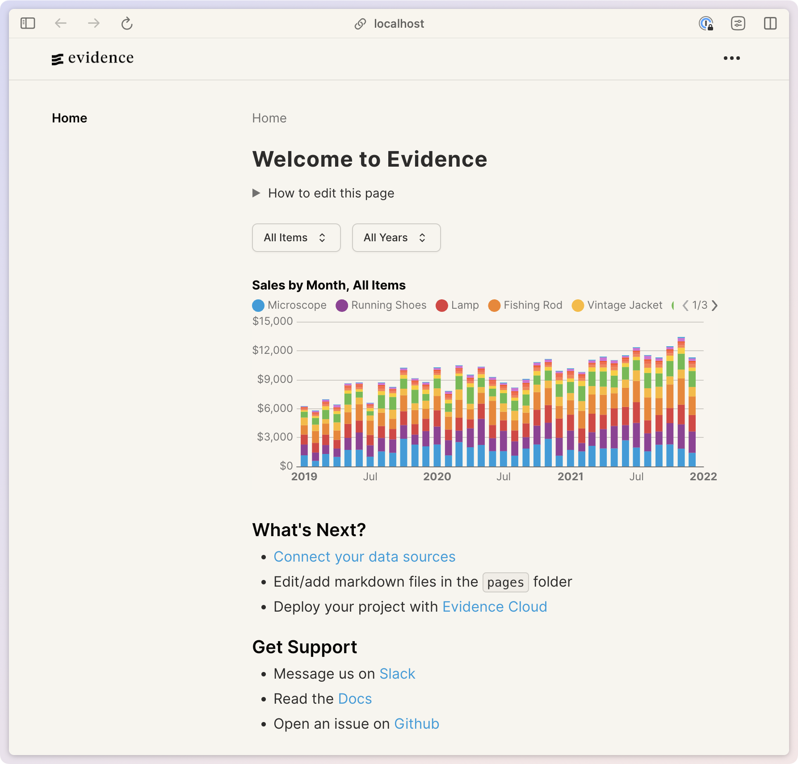

# Evidence Sample Themes

This repository contains a collection of pre-made themes for Evidence. 

- [Default](#default)
- [Desert](#desert)
- [Dracula](#dracula)
- [Forest](#forest)
- [Mono](#mono)
- [Plasma](#plasma)
- [Retro](#retro)

Each theme includes both light and dark mode variants.

**To use a theme:**
- Copy the `theme` config into your project's `evidence.config.yaml` 
- Restart Evidence for the changes to take effect.

## Default

[Default Config](default/evidence.config.yaml)

| Light | Dark |
| :---: | :---: |
|  |  |

## Desert

[Desert Config](desert/evidence.config.yaml)

| Light | Dark |
| :---: | :---: |
|  |  |

## Dracula

[Dracula Config](dracula/evidence.config.yaml)

> Note: Dracula is a dark only theme

| Light | Dark |
| :---: | :---: |
|  |  |

## Forest

[Forest Config](forest/evidence.config.yaml)

| Light | Dark |
| :---: | :---: |
|  |  |

## Mono

[Mono Config](mono/evidence.config.yaml)

| Light | Dark |
| :---: | :---: |
|  |  |

## Plasma

[Plasma Config](plasma/evidence.config.yaml)

| Light | Dark |
| :---: | :---: |
|  |  |

## Retro

[Retro Config](retro/evidence.config.yaml)

| Light | Dark |
| :---: | :---: |
|  |  |
